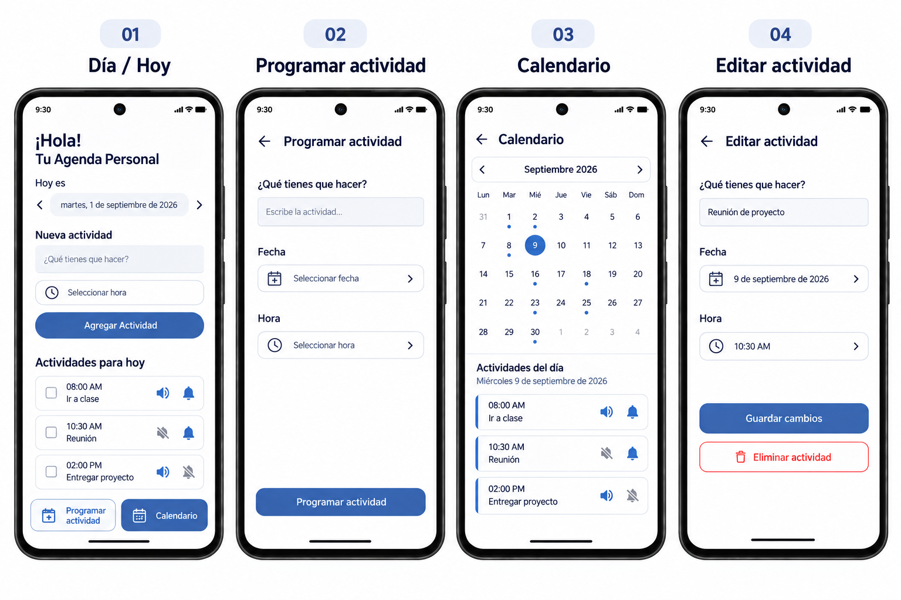

# 📅 Agenda Personal

## 1. Descripción del proyecto

**Agenda Personal** será una aplicación móvil para Android orientada principalmente a la **organización de actividades y compromisos laborales**, aunque también podrá utilizarse para actividades personales y académicas. La **pantalla principal** estará centrada en el día actual y mostrará las actividades pendientes correspondientes a esa fecha, permitiendo consultar rápidamente lo que está pendiente y agregar nuevas actividades.

La pantalla principal incluirá un encabezado de bienvenida, la fecha que se está consultando, navegación al día anterior o siguiente, un espacio para registrar rápidamente una actividad y su hora, y una sección de actividades organizadas cronológicamente. Las actividades completadas se ocultarán de esta vista para mantenerla limpia y enfocada en los pendientes.

Desde la pantalla principal habrá opciones para acceder a una **vista de calendario mensual** y a una sección para **programar actividades para fechas futuras**. El calendario permitirá reconocer mediante un punto los días que tienen actividades y seleccionar una fecha para consultar sus actividades.

La aplicación generará un recordatorio visual y sonoro cuando llegue la hora programada. Cada actividad contará con controles independientes para activar o silenciar el **sonido 🔊** y la **notificación 🔔** directamente desde su tarjeta. Al aceptar la actividad, esta se marcará como completada y dejará de aparecer entre los pendientes del día, pero permanecerá almacenada para permitir implementar posteriormente un historial de actividades completadas.

La propuesta inicial busca mantener una aplicación sencilla, práctica y fácil de utilizar, pero con una estructura que permita ampliar sus funciones después de finalizar el proyecto académico.

## 2. Exposición del problema

En mi experiencia laboral, tengo diariamente diferentes **tareas, actividades y compromisos** que debo recordar y atender durante la jornada, la semana y el mes. Cuando se acumulan varios pendientes, puede resultar difícil mantenerlos todos presentes, especialmente cuando se utiliza la memoria o diferentes medios para registrar lo que se necesita realizar.

Aunque existen herramientas como Google Calendar y otras aplicaciones de organización, en algunas ocasiones considero que registrar una actividad puede resultar más elaborado de lo necesario cuando solamente se desea anotar rápidamente algo que se debe hacer. Esto puede llevar a que algunos pendientes terminen registrados en diferentes lugares o a que se dependa de la memoria para recordarlos.

A partir de esta necesidad surge la idea de desarrollar una agenda móvil sencilla, con un enfoque inicial en la **organización de actividades laborales**, que muestre en primer lugar los pendientes del día actual, facilite el registro rápido de nuevas actividades, permita programar compromisos futuros y ofrezca una visión mensual de las actividades. También se busca evitar que las actividades ya realizadas permanezcan acumuladas en la pantalla principal.

## 3. Objetivo del proyecto

### Objetivo general

Desarrollar una aplicación móvil para Android que facilite la **organización y seguimiento de actividades laborales**, mediante una pantalla principal centrada en el día actual, una vista de calendario mensual y un sistema de recordatorios.

### Objetivos específicos

- Mostrar inicialmente las actividades pendientes correspondientes al día actual.
- Permitir registrar rápidamente una actividad para el día actual indicando su descripción y hora.
- Permitir navegar entre días desde la pantalla principal para consultar otras fechas.
- Permitir consultar las actividades de diferentes fechas mediante un calendario mensual.
- Permitir programar actividades para fechas diferentes a la fecha actual.
- Permitir editar una actividad existente, incluyendo su descripción, fecha y hora.
- Permitir eliminar actividades.
- Permitir marcar una actividad como completada y ocultarla de las actividades pendientes.
- Mantener almacenadas las actividades completadas para posibilitar un historial futuro.
- Organizar automáticamente las actividades pendientes por hora.
- Incorporar recordatorios visuales y sonoros asociados a las actividades.
- Permitir activar o silenciar de forma independiente el sonido y la notificación de cada actividad.
- Permitir aceptar o posponer un recordatorio cuando llegue la hora programada.
- Mantener una primera versión sencilla y funcional que pueda ampliarse posteriormente.

## 4. Plataforma

El proyecto será desarrollado inicialmente para dispositivos **Android**, utilizando **Android Studio** como entorno de desarrollo.

Durante el desarrollo se estudiarán las herramientas y componentes necesarios para implementar la interfaz, el almacenamiento de la información, la gestión de fechas y horas y el sistema de notificaciones. La primera versión estará orientada principalmente al funcionamiento local en el dispositivo, dejando abierta la posibilidad de incorporar servicios adicionales en futuras versiones.

## 5. Interfaz de usuario e interfaz de administración

### Interfaz de usuario

La aplicación estará diseñada principalmente para un usuario que necesita organizar sus actividades laborales. Las principales vistas y funciones consideradas inicialmente son:

- **Pantalla principal / vista diaria:** mostrará un mensaje de bienvenida, la fecha consultada con navegación entre días, un formulario de registro rápido de actividades y las actividades pendientes del día ordenadas por hora.
- **Nueva actividad rápida:** permitirá escribir qué se necesita realizar y seleccionar una hora. Al registrarla desde la pantalla principal, quedará asociada automáticamente al día que se esté consultando.
- **Programar actividad:** permitirá crear una actividad para una fecha específica, indicando descripción, fecha y hora.
- **Vista mensual:** mostrará un calendario del mes con un punto en los días que tengan actividades y permitirá seleccionar una fecha para consultar sus actividades.
- **Edición de actividad:** al seleccionar una actividad se podrá modificar su descripción, fecha u hora, o eliminarla.
- **Controles de recordatorio:** cada tarjeta de actividad tendrá un botón de sonido y un botón de notificación que podrán activarse o silenciarse de forma independiente.
- **Recordatorio:** cuando llegue la fecha y hora programadas se mostrará una alerta visual y sonora según la configuración de la actividad, con opciones para aceptar o posponer.

La pantalla diaria se mantendrá enfocada en las actividades pendientes. Las actividades completadas se ocultarán de esta vista, mientras que sus datos se conservarán para una posible función de historial posterior.

### Interfaz de administración

La primera versión del proyecto no contempla diferentes tipos de usuarios ni un perfil administrativo independiente, debido a que la aplicación está planteada como una herramienta de uso personal para la **organización de actividades, principalmente laborales**. Las opciones de gestión necesarias estarán disponibles directamente para el usuario.

## 6. Funcionalidad

| Funcionalidad | Descripción |
|---|---|
| Pantalla diaria | Mostrar las actividades pendientes del día consultado. |
| Bienvenida y fecha | Mostrar un mensaje de bienvenida y la fecha consultada. |
| Navegación entre días | Permitir ir al día anterior o siguiente sin eliminar actividades. |
| Agregar actividad | Registrar rápidamente una actividad para el día consultado. |
| Selector de hora | Seleccionar hora mediante una interfaz sencilla con horas, minutos y AM/PM. |
| Orden cronológico | Mostrar automáticamente las actividades pendientes ordenadas por hora. |
| Programar actividad | Registrar una actividad para una fecha específica, incluyendo fechas futuras. |
| Vista mensual | Mostrar un calendario con puntos en los días que tengan actividades. |
| Consulta por fecha | Mostrar las actividades correspondientes a una fecha seleccionada. |
| Editar actividad | Modificar la descripción, fecha u hora de una actividad existente. |
| Eliminar actividad | Eliminar una actividad que ya no sea necesaria. |
| Completar actividad | Marcar una actividad como realizada y ocultarla de las actividades pendientes. |
| Conservación de completadas | Mantener almacenadas las actividades completadas para un historial futuro. |
| Sonido | Activar o silenciar de forma independiente el aviso sonoro de una actividad. |
| Notificación | Activar o silenciar de forma independiente la notificación de una actividad. |
| Recordatorio | Programar una alerta asociada a la fecha y hora de una actividad. |
| Posponer | Permitir posponer un recordatorio para volver a notificar posteriormente. |

## 7. Diseño y wireframes

Los wireframes se utilizan para definir la estructura visual, la distribución de los elementos y el flujo de navegación de las principales pantallas antes de completar la implementación. El diseño mantiene una línea visual sencilla, consistente y centrada en la gestión rápida de actividades.

### Wireframe 01 — Día / Hoy


Pantalla principal de la aplicación. Incluye el encabezado de bienvenida, la fecha consultada con navegación entre días, creación rápida de actividades, lista cronológica de actividades y acceso a las funciones principales.

- Navegación al día anterior y siguiente.
- Registro rápido con descripción y hora.
- Actividades pendientes ordenadas por hora.
- Cada actividad puede abrirse para edición al tocarla.
- Cada actividad dispone de controles independientes de **sonido 🔊** y **notificación 🔔**.
- Botón **Programar actividad** en la parte inferior.
- Botón **Calendario** en la parte inferior.
- No se incorpora un contador de actividades ni un bloque especial para la próxima actividad.

### Wireframe 02 — Programar actividad


Pantalla destinada a crear una actividad para una fecha y hora específicas, especialmente para actividades futuras.

- Regreso a la pantalla anterior.
- Campo para la descripción de la actividad.
- Selector de fecha.
- Selector de hora.
- Botón **Programar actividad**.
- Los controles de sonido y notificación se gestionan posteriormente desde la tarjeta de la actividad.

### Wireframe 03 — Calendario


Pantalla de consulta mensual y navegación entre fechas.

- Navegación entre meses.
- Punto debajo del número en los días que tienen actividades.
- Resaltado visual del día seleccionado.
- Selección de un día para consultar sus actividades.
- Lista de actividades correspondientes a la fecha seleccionada.
- Las actividades conservan sus controles independientes de sonido y notificación.
- No incluye un botón adicional de **Programar actividad** para evitar duplicar la acción principal.

### Wireframe 04 — Editar actividad


Pantalla utilizada al tocar una actividad desde Día/Hoy o Calendario.

- Regreso sin guardar cambios.
- Edición de descripción.
- Cambio de fecha.
- Cambio de hora.
- Botón **Guardar cambios**.
- Botón **Eliminar actividad**.
- Los controles de sonido y notificación continúan gestionándose desde la tarjeta de la actividad.

### Wireframes completos



### Flujo principal

```text
Día / Hoy
   ├── Agregar actividad
   ├── Programar actividad
   ├── Calendario
   │      └── Seleccionar día → consultar actividades
   └── Tocar actividad → Editar actividad
```

El conjunto actual de wireframes cubre el flujo principal de **consultar, crear, programar, navegar por fechas, editar y gestionar actividades**. Funciones adicionales se podrán documentar posteriormente si se incorporan al alcance.

## 8. Alcance inicial

La primera versión del proyecto se enfocará en las funciones básicas de una agenda personal, con **prioridad en la organización de actividades laborales**, dando especial importancia a la pantalla del día actual, la consulta mediante calendario mensual, la programación de actividades y el funcionamiento de los recordatorios.

La pantalla principal deberá permitir registrar rápidamente actividades del día, seleccionar su hora, visualizarlas ordenadas cronológicamente, completarlas y editarlas. Las actividades completadas se ocultarán de la vista diaria, pero permanecerán almacenadas.

Las actividades programadas para fechas futuras se conservarán hasta llegar a su fecha correspondiente. Al cambiar el día, la vista diaria mostrará únicamente las actividades de la nueva fecha; no se propone borrar físicamente las actividades anteriores.

Se priorizará que registrar, consultar, editar y completar una actividad sea rápido y sencillo.

## 9. Posibles mejoras futuras

Una vez finalizado el proyecto académico, se contempla la posibilidad de continuar su desarrollo incorporando nuevas funciones según las necesidades identificadas durante su utilización. Algunas posibilidades podrían ser:

- Historial de actividades completadas.
- Actividades recurrentes.
- Estadísticas de actividades completadas.
- Mayor personalización de los recordatorios.
- Copias de seguridad de la información.
- Sincronización entre dispositivos.
- Integración con otros servicios de calendario.
- Mejoras de diseño y accesibilidad.

Estas funciones no forman parte del alcance inicial y se considerarían posteriormente de acuerdo con la evolución del proyecto.
