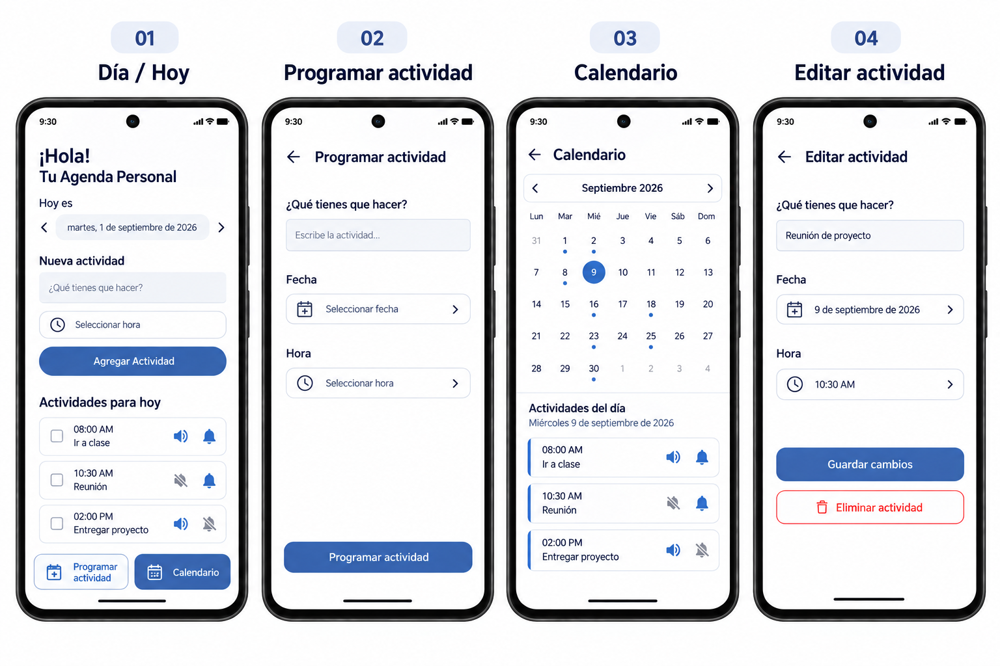

# 📅 Agenda Personal

## 1. Descripción del proyecto

**Agenda Personal** es una aplicación móvil para Android orientada principalmente a la organización de actividades y compromisos laborales, aunque también puede utilizarse para actividades personales y académicas.

La aplicación permite consultar actividades por fecha, registrar actividades para el día consultado, programar actividades para fechas futuras y revisar las actividades desde un calendario mensual. Los datos se almacenan localmente mediante **Room**, por lo que las actividades permanecen guardadas en la base de datos del dispositivo.

El proyecto se desarrolla de forma incremental. Este README distingue entre las funciones que ya están implementadas y las que todavía están pendientes.

## 2. Exposición del problema

En la jornada laboral pueden acumularse tareas, actividades y compromisos que deben atenderse durante el día, la semana o el mes. Cuando se depende de la memoria o de diferentes medios para registrarlos, puede resultar difícil mantenerlos organizados y recordar cuándo deben realizarse.

Aunque existen herramientas de calendario y organización, registrar una actividad sencilla puede sentirse más elaborado de lo necesario. De esta necesidad surge la propuesta de desarrollar una agenda móvil que facilite el registro rápido de actividades, la consulta por fecha y la organización de compromisos futuros desde una interfaz sencilla.

## 3. Objetivos del proyecto

### Objetivo general

Desarrollar una aplicación móvil para Android que facilite la organización y el seguimiento de actividades, mediante una vista diaria, un calendario mensual y almacenamiento local.

### Objetivos específicos

- Consultar las actividades correspondientes a una fecha.
- Registrar rápidamente una actividad para el día consultado.
- Navegar entre días desde la pantalla principal.
- Consultar actividades mediante un calendario mensual.
- Programar actividades para fechas futuras.
- Editar la descripción, fecha y hora de una actividad que no esté completada.
- Eliminar actividades.
- Marcar actividades como completadas y conservar su información.
- Mostrar las actividades en orden cronológico.
- Guardar las actividades localmente para conservarlas entre ejecuciones de la aplicación.
- Preparar la estructura para implementar recordatorios y notificaciones en una etapa posterior.

## 4. Plataforma y tecnologías

- **Plataforma:** Android.
- **Entorno de desarrollo:** Android Studio.
- **Lenguaje:** Kotlin.
- **Interfaz:** Jetpack Compose y Material 3.
- **Persistencia local:** Room.
- **Arquitectura de estado:** ViewModel, StateFlow y corrutinas.
- **Navegación:** Navigation Compose.

La aplicación está orientada inicialmente al funcionamiento local en el dispositivo. La sincronización entre dispositivos y otros servicios externos no forman parte del alcance actual.

## 5. Pantallas y navegación

### Día

La pantalla diaria permite consultar las actividades de la fecha seleccionada, navegar al día anterior o siguiente y registrar rápidamente una actividad indicando su título y hora. Si la fecha no tiene actividades, se muestra un mensaje informativo.

Las actividades se presentan por fecha y hora. Las actividades completadas conservan su registro y muestran su estado; no se permite abrirlas para editarlas o reprogramarlas. La interfaz informa: **«Las actividades completadas no se pueden editar.»**

La creación rápida está destinada al día consultado. Para crear nuevas actividades mediante la pantalla de programación, se selecciona una fecha futura.

### Programar actividad

Permite registrar una actividad indicando título, fecha y hora. Para las nuevas actividades, la fecha seleccionable comienza en el día siguiente; no se permite programarlas para hoy ni para una fecha pasada.

### Calendario

Muestra un calendario mensual con indicadores en los días que contienen actividades. Al seleccionar un día, se presenta la lista de actividades correspondientes a esa fecha, ordenadas por hora.

### Editar actividad

Permite modificar el título, la fecha y la hora de una actividad que no esté completada. La fecha no puede establecerse en el pasado. Si se selecciona el día actual, la hora debe ser la actual o una posterior. Las actividades completadas no se pueden editar ni reprogramar.

La eliminación de actividades está disponible como una operación independiente dentro del flujo de edición.

## 6. Funcionalidades implementadas

| Funcionalidad | Estado y comportamiento |
|---|---|
| Consulta diaria | Implementada; permite consultar las actividades de la fecha seleccionada. |
| Navegación entre días | Implementada. |
| Registro rápido | Implementado para el día consultado, con validación de la hora cuando corresponde. |
| Programación de actividades | Implementada para fechas futuras; la primera fecha permitida es mañana. |
| Calendario mensual | Implementado, con indicadores de días que tienen actividades. |
| Consulta por fecha | Implementada desde el calendario. |
| Edición de actividades | Implementada para actividades no completadas. |
| Validación de fecha y hora | Implementada para impedir fechas pasadas y horas pasadas cuando la actividad se programa para hoy. |
| Eliminación de actividades | Disponible desde el flujo de edición. |
| Estado de completada | Implementado y conservado en la base de datos. |
| Protección de actividades completadas | Implementada; no permite editarlas ni reprogramarlas. |
| Almacenamiento local | Implementado mediante Room. |
| Estado de alarma por actividad | Implementado como dato persistente; permite activar o silenciar la configuración de alarma de cada actividad. |
| Programación real de alarmas | Pendiente. |
| Notificaciones del sistema | Pendientes. |
| Acciones desde una notificación | Pendientes. |

**Importante:** que una actividad tenga guardado el estado de su alarma no significa que el sistema ya programe o dispare una alarma real. La integración con alarmas y notificaciones se desarrollará posteriormente.

## 7. Persistencia de datos

Room administra el almacenamiento local de las actividades. La estructura principal está compuesta por:

- **Actividad.kt:** define la entidad y los datos de cada actividad, incluidos su identificador, título, fecha, hora, estado de completada y estado de alarma.
- **ActividadDao.kt:** define las operaciones para consultar, insertar, actualizar y eliminar actividades.
- **AgendaDatabase.kt:** configura la base de datos local y la migración que incorpora el campo `alarmaActiva`.
- **AgendaViewModel.kt:** expone las actividades a la interfaz y ejecuta las operaciones sobre la base de datos mediante corrutinas.

La lista de actividades se consulta de forma reactiva. Cuando Room registra cambios, el estado observado por la interfaz puede actualizarse automáticamente.

## 8. Diseño y wireframes

Los siguientes wireframes documentan la propuesta visual inicial. Se conservan como referencia del diseño; algunos controles representados, especialmente los de sonido y notificación separados, no corresponden a la interfaz implementada actualmente.

### Wireframe 01 — Día / Hoy


Representa la pantalla principal, la navegación entre días, el registro rápido, la lista de actividades y los accesos a las demás pantallas.

### Wireframe 02 — Programar actividad


Representa el formulario para definir el título, la fecha y la hora de una actividad.

### Wireframe 03 — Calendario


Representa la consulta mensual, los indicadores de días con actividades y la selección de una fecha.

### Wireframe 04 — Editar actividad


Representa la edición de una actividad existente y las acciones relacionadas.

### Wireframes completos



### Flujo principal

```text
Día
 ├── Registrar actividad para el día consultado
 ├── Programar actividad para una fecha futura
 ├── Calendario
 │    └── Seleccionar fecha y consultar actividades
 └── Seleccionar actividad no completada
      └── Editar o eliminar
```

## 9. Alcance actual y trabajo pendiente

La versión actual prioriza la consulta, creación, edición, eliminación y conservación local de actividades. También incluye la consulta por calendario, las validaciones de fecha y hora y la protección de actividades completadas.

Las siguientes tareas quedan pendientes:

- Implementar la programación de alarmas reales para cada actividad.
- Implementar las notificaciones del sistema.
- Definir y desarrollar las acciones de la notificación: completar, reprogramar y no completar.
- Determinar el comportamiento del sonido y la persistencia de los recordatorios.
- Revisar visualmente las tarjetas de Día y Calendario al integrar las notificaciones.
- Probar el flujo completo de creación, edición, eliminación y conservación de actividades.
- Completar la revisión y documentación de los archivos del proyecto.
- Realizar las pruebas finales y preparar la entrega académica.

Como posibles mejoras posteriores se consideran un historial específico de actividades completadas, actividades recurrentes, estadísticas, copias de seguridad, sincronización y personalización adicional. Estas mejoras no forman parte del alcance implementado actualmente.

## 10. Registro de cambios (Changelog)

### Avances anteriores

- Se definió el propósito de Agenda Personal y se diseñaron los wireframes iniciales.
- Se implementó la pantalla diaria y la navegación entre fechas.
- Se incorporó la pantalla para programar actividades futuras.
- Se implementó el almacenamiento local mediante Room.
- Se incorporó AgendaViewModel para conectar la interfaz con la base de datos.
- Se desarrolló el calendario mensual y la consulta de actividades por fecha.

### Avances recientes

- Se ajustaron las pantallas de Día, Calendario, Programar actividad y Editar actividad.
- Se incorporó la edición y eliminación de actividades.
- Se agregaron validaciones para impedir programar actividades nuevas en fechas pasadas o en el día actual desde la pantalla de programación.
- Se agregó validación de fecha y hora al editar actividades.
- Se impide editar o reprogramar actividades completadas y se informa al usuario del motivo.
- Se añadió un mensaje para los días sin actividades.
- Se incorporó el estado persistente de alarma por actividad.
- Se está documentando el código para facilitar su comprensión y mantenimiento.

### Próximos avances

- Finalizar la revisión de la documentación de los archivos.
- Revisar la interfaz y comprobar los flujos de uso.
- Implementar las alarmas y notificaciones reales.
- Probar el comportamiento de las notificaciones y sus acciones.
- Preparar y verificar la versión final del proyecto.
